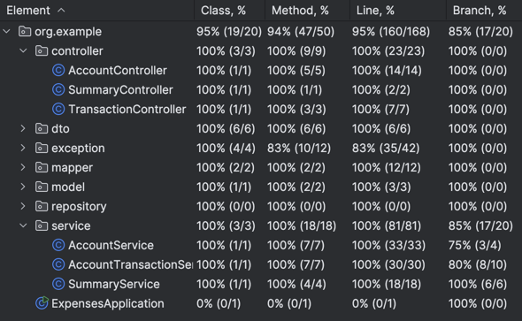

# Expenses Application

## Requirements

* Java 21
* Maven
* Docker

---

## Running application

Start the application using Docker:

```
docker compose up --build
```

Application will be available at:

```
http://localhost:8080
```

---

## Tests

The project contains the following types of tests:

- Unit tests for service layer using JUnit and Mockito
- Controller tests using Spring MockMvc
- Integration tests using RestAssured

Integration tests run against a real PostgreSQL database using Testcontainers.


---

## API

### Create Account

**POST** `/accounts`

Request:

```json
{
  "name": "KONTO 1"
}
```

Response:

```json
{
  "id": 2,
  "name": "KONTO 1",
  "balance": 0
}
```

---

### Get All Accounts

**GET** `/accounts`

Returns all accounts.

---

### Get Account By ID

**GET** `/accounts/{id}`

Example:

```http
GET /accounts/1
```

Returns one accounts.

---

### Delete Account

**DELETE** `/accounts/{id}`

Example:

```http
DELETE /accounts/1
```

---

### Create Income Transaction

**POST** `/transactions`

Request:

```json
{
  "amount": 5000,
  "type": "INCOME",
  "category": "Salary",
  "description": "Monthly salary",
  "transactionDate": "2026-06-07",
  "accountId": 1
}
```

Response:

```json
{
  "id": 7,
  "amount": 5000,
  "type": "INCOME",
  "category": "Salary",
  "description": "Monthly salary",
  "transactionDate": "2026-06-07",
  "accountId": 1
}
```

---

### Create Expense Transaction

**POST** `/transactions`

Request:

```json
{
  "amount": 6000,
  "type": "EXPENSE",
  "category": "IT",
  "transactionDate": "2026-06-04",
  "accountId": 1
}
```

Response:

```json
{
  "id": 4,
  "amount": 6000,
  "type": "EXPENSE",
  "category": "IT",
  "description": null,
  "transactionDate": "2026-06-04",
  "accountId": 1
}
```

---

### Get Transactions

**GET** `/transactions`

Example:

```http
GET /transactions?category=Salary
```

Returns a list of transactions matching the provided filters.

---

### Delete Transaction

**DELETE** `/transactions/{id}`

Example:

```http
DELETE /transactions/2
```

---

### Financial Summary

**GET** `/summary`

Returns aggregated information about:

- total income
- total expenses
- total expenses by category

---

### Export Account Transactions

**GET** `/accounts/{id}/transactions/export`

Example:

```http
GET /accounts/1/transactions/export
```

Exports transactions to CSV for the selected account.
